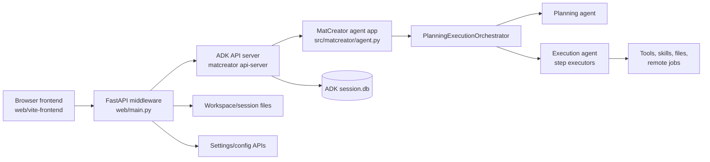
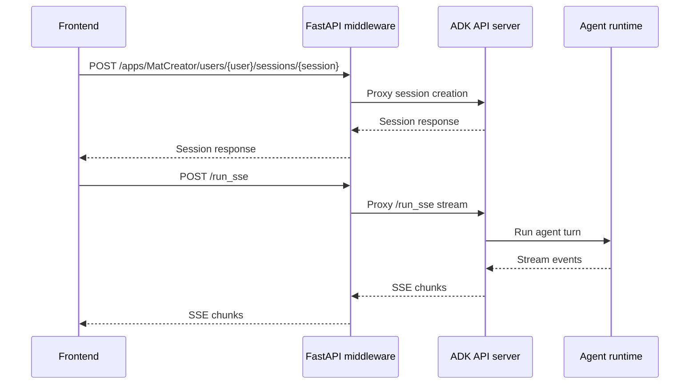
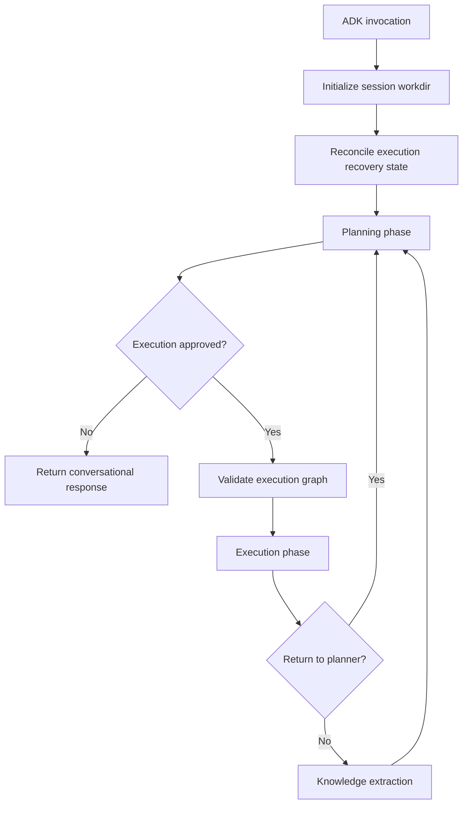
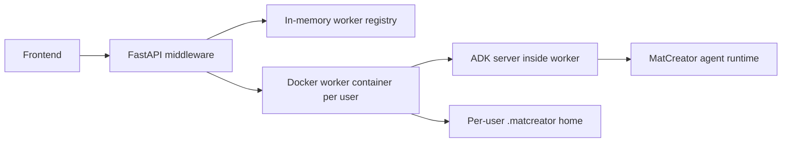
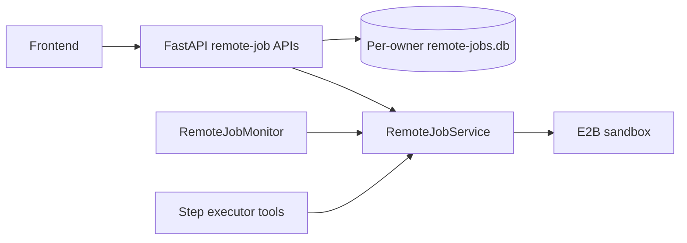

# MatCreator Structural Components

This document summarizes the current high-level structure of MatCreator and how the frontend, middleware, and agent framework relate to each other.

## Overview

MatCreator is currently organized as a browser frontend, a lightweight FastAPI middleware server, and a Google ADK-based agent runtime. The frontend owns the user interaction loop. The FastAPI server provides MatCreator-specific APIs and proxies ADK traffic. The ADK server hosts the actual agent framework and session execution.



## 1. Frontend

The frontend lives under `web/vite-frontend` and is built with Vite. Its main entry point is `web/vite-frontend/src/main.js`.

Primary responsibilities:

- Render chat, session history, files, graphs, settings, and structure viewers.
- Create or load ADK sessions through proxied `/apps/.../sessions/...` endpoints.
- Send user turns by posting to `/run_sse`.
- Consume streamed ADK events from Server-Sent Events.
- Poll MatCreator-specific graph/file endpoints such as `/api/agent-graph/{session_id}` and `/api/sessions/{session_id}/files`.
- Manage browser-local UI state such as selected session, active user, theme, uploads, and panels.

Current request flow for a user message:



Important current limitation: the browser owns the live `/run_sse` stream. If the tab closes or the request is aborted, the frontend-side stream consumer disappears. This is the main reason a future resilient control-plane layer is useful.

## 2. Middleware

The middleware is the FastAPI application in `web/main.py`.

It currently has two broad roles.

### ADK Proxy

The middleware forwards ADK protocol traffic:

- `/run_sse`
- `/apps/{path:path}`
- `/list-apps`

In local mode, these proxy to the local ADK server on the configured ADK port. In server mode, the middleware determines the user, starts or reuses that user's worker container, and proxies traffic to the correct worker.

### MatCreator API Surface

The middleware also exposes MatCreator-specific APIs that are not plain ADK endpoints, including:

- Session listing and access control.
- Session summaries and session-log export.
- Agent graph and execution graph data.
- Workspace file listing, upload, delete, and file serving.
- Structure viewing/modeling/save/interface endpoints.
- Skill graph and custom skill management.
- Settings and environment configuration.
- Worker management in server mode.
- Cancellation endpoints for sessions and individual steps.

The middleware therefore acts as the application backend from the frontend's point of view, even though live agent execution is still delegated to ADK.

## 3. Agent Framework

The agent runtime is launched by `src/matcreator/scripts/start_agent.py`, especially the `matcreator api-server` command.

Key responsibilities:

- Start the ADK FastAPI app programmatically.
- Use a custom ADK agent loader so ADK loads MatCreator's agent app directly.
- Store ADK session state in `~/.matcreator/.adk/session.db` by default, or in the server-mode MatCreator home.
- Resolve workspace location and runtime configuration before the agent starts.

The main orchestration logic is in `src/matcreator/agents/orchestrator/agent.py`.

Current orchestration shape:



The orchestrator always starts with planning. If the planning agent approves a graph for execution, control moves to the execution agent, which runs step executors and tools. After execution completes or is interrupted, the orchestrator can return to planning within the same ADK invocation.

## 4. Current Component Boundaries

The current boundaries can be summarized like this:

| Layer | Owns | Does Not Own |
| --- | --- | --- |
| Frontend | UI state, rendering, user input, direct SSE consumption | Durable execution lifecycle |
| FastAPI middleware | MatCreator APIs, auth/session views, file/config/structure APIs, ADK proxying, worker routing | Agent reasoning and durable scheduling |
| ADK agent framework | Agent invocation, session state, planning/execution loop, step execution | Browser reconnect semantics or frontend state |
| Tools/skills | Concrete scientific/file/remote-job operations | Session scheduling policy |

## 5. Server Mode Relationship

In server mode, the FastAPI middleware also acts as a worker control plane for Docker-based ADK workers.



The server-mode worker registry is currently process-local. Existing containers can continue to exist outside the middleware process, but the in-memory registry itself is not a durable scheduler.

## 6. Remote Job Control Plane

Remote E2B sandbox work now has a durable control-plane implementation separate
from the browser-owned `/run_sse` connection. It persists provider identity and
lifecycle state, periodically reconciles active sandboxes, and gives the
frontend owner-scoped pause, terminate, and refresh APIs.



Remote jobs outlive a frontend request and agent reconnection because their
records and provider sandbox IDs are persisted. The monitor's polling schedule
is process-local, but it rediscovers active records after restart. The broader
agent-run lifecycle remains request/stream oriented. See [Remote Job
Monitoring](remote_job_monitoring.md) for the state model, concurrency rules,
ownership, and APIs.

## 7. Practical Reading Map

Start with these files when navigating the architecture:

- `web/vite-frontend/src/main.js` — frontend chat/session/SSE behavior.
- `web/main.py` — FastAPI middleware, ADK proxying, MatCreator APIs, worker management.
- `src/matcreator/scripts/start_agent.py` — CLI and ADK API-server startup.
- `src/matcreator/agents/orchestrator/agent.py` — planning/execution orchestration.
- `src/matcreator/agents/execution_agent/` — execution-agent and step-executor behavior.
- `src/matcreator/control_plane/` — durable remote-job store, service, E2B adapter, and monitor.
- `docs/remote_job_monitoring.md` — remote-job monitoring lifecycle and operations.
- `src/matcreator/workspace.py` — workspace and session workdir resolution.
- `src/matcreator/config.py` and `src/matcreator/ports.py` — runtime configuration and port resolution.

## Summary

The current system is best understood as:

```text
Frontend -> FastAPI middleware/proxy -> ADK agent framework -> MatCreator agents/tools
```

The middleware already centralizes many application APIs and server-mode worker routing, but live agent execution is still request/stream oriented. A resilient control-plane layer would evolve the middleware from a proxy-plus-API server into the owner of active run lifecycle, reconnectable event streams, and eventually durable scheduling.
