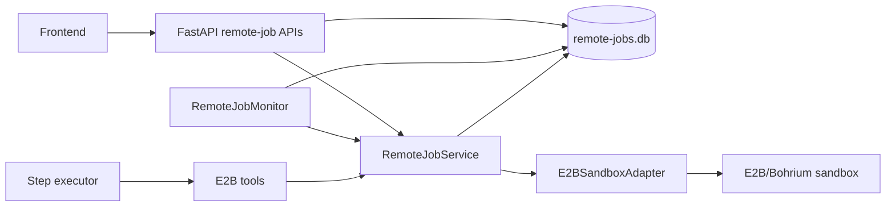

# Remote Job Monitoring

MatCreator manages E2B sandboxes as durable, session-scoped remote jobs. The
remote-job control plane separates a sandbox's provider identity and liveness
from the agent step that created it, so the FastAPI frontend can observe and
control the sandbox after an agent, browser, or middleware request reconnects.

## Architecture



The SQLite record is the source of truth for MatCreator's normalized job
lifecycle. The provider sandbox remains the source of truth for provider
liveness. This distinction lets the UI report both a meaningful lifecycle state
and the latest connectivity observation without conflating them.

## Key Components

| Component | Location | Responsibility |
| --- | --- | --- |
| `RemoteJobStore` | `src/matcreator/control_plane/remote_jobs.py` | Persists jobs, lifecycle transitions, provider snapshots, and user-control events in SQLite. |
| `RemoteJobService` | `src/matcreator/control_plane/remote_job_service.py` | Coordinates E2B operations with durable records and enforces valid lifecycle operations. |
| `E2BSandboxAdapter` | `src/matcreator/control_plane/e2b.py` | Small lazy-import boundary around the E2B SDK for sandbox creation, commands, files, pause, kill, and probing. |
| `RemoteJobMonitor` | `src/matcreator/control_plane/remote_job_monitor.py` | Periodically reconciles active E2B records and applies bounded backoff after failed probes. |
| Agent tools | `src/matcreator/agents/execution_agent/e2b_tools.py` | Submit and operate on jobs owned by the current session. |
| Middleware APIs | `web/main.py` | List jobs/events and offer session-owner pause, terminate, and refresh endpoints. |

## Submission and Persistence

`submit_e2b_sandbox` requires an explicit template. It creates a deterministic
idempotency key from the session, execution node, and template, then delegates
to `RemoteJobService.submit_e2b`.

The service creates the SQLite job record before making the provider request.
The persisted specification contains the template, endpoint, project ID,
timeout, lifecycle policy, and metadata, but never the API key. Repeated calls
with the same idempotency key return the existing job instead of creating a
second sandbox.

Once sandbox creation succeeds, the service stores the provider sandbox ID in
`external_id` and transitions the job to `running`. Agent recovery records the
job reference against the execution graph so an interrupted execution can wait
for or accurately report an existing sandbox rather than resubmitting it.

## Lifecycle and Observations

The store protects lifecycle changes with an allowed-transition state machine.
Important normalized states include:

- `created`, `submitting`, `queued`, `running`, `paused`, and `resuming` for
  active work.
- `succeeded` and `collecting` while a job's results are being handled.
- `collected`, `failed`, `cancelled`, `terminated`, and `lost` as terminal
  outcomes.

Each change increments `state_revision` and writes an event. Lifecycle
transitions use optimistic concurrency checks, so stale pause, terminate, or
provider updates cannot silently overwrite newer state.

Provider probe data is stored in `snapshot`; examples include
`provider_status`, `sandbox_id`, `last_command_exit_code`, and `last_upload`.
An observation does not itself alter the normalized lifecycle state.

## Monitoring and Refresh

`RemoteJobMonitor` considers active E2B jobs and probes jobs in `queued`,
`running`, `submitting`, or `resuming` states. A successful probe records a
reachable provider snapshot. A failed probe records `provider_status` as
`unreachable` and increases the next probe delay exponentially, bounded by the
configured maximum backoff.

Monitor schedules are intentionally in memory. The job records themselves are
durable, so a restarted monitor begins by reconciling active jobs from SQLite.
The frontend can also explicitly reconcile an owned job through:

```text
POST /api/sessions/{session_id}/remote-jobs/{job_id}/refresh
```

## Command and Upload Concurrency

Sandbox commands and uploads can take long enough for the monitor or a manual
refresh to update the same record. These operations use
`RemoteJobStore.merge_observation`, which atomically merges non-lifecycle
telemetry into the latest snapshot. Therefore a successful command is returned
to the agent even when a monitor probe updates the job while that command runs.

Strict revision checks remain in place for lifecycle transitions and provider
reconciliation, where accepting stale state would be unsafe.

## Controls and Ownership

The middleware exposes owner-scoped controls:

```text
POST /api/sessions/{session_id}/remote-jobs/{job_id}/pause
POST /api/sessions/{session_id}/remote-jobs/{job_id}/terminate
```

Both invoke the provider operation through `RemoteJobService`, update the
durable job lifecycle, and append a `user_control` event. They do not cancel
the step-executor process. The executor sees this event through
`get_e2b_job_status` and must report `needs_replanning` rather than retrying an
interrupted command or submitting a replacement sandbox.

`terminate_e2b_sandbox` irreversibly releases a sandbox. Agents should collect
or record required output before calling it.

## Storage Scope

In local mode, agent tools use `ADK_DIR / "remote-jobs.db"`. In server mode,
the middleware routes each owner to a per-user `.adk/remote-jobs.db` under the
user's mounted MatCreator home. This keeps job records, controls, and monitoring
isolated by owner and session.

## Operational Notes

- The control plane currently supports E2B sandboxes, although the persistent
  store is provider-neutral by design.
- Commands do not persist command text or output in the remote-job database;
  only limited operational telemetry is recorded.
- A sandbox's configured creation timeout is distinct from the monitoring
  interval. The adapter currently passes `timeout=0` to E2B command execution,
  leaving command duration unrestricted by this control plane.
