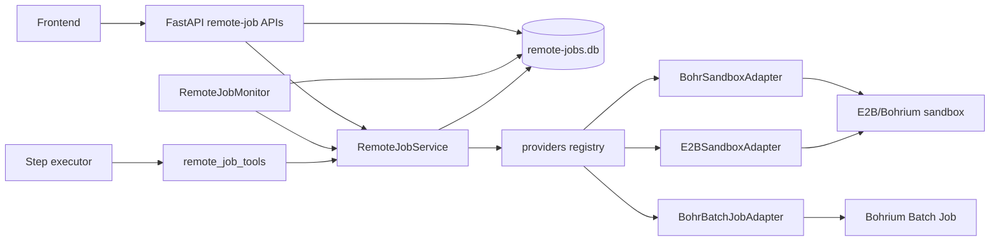

# Remote Job Monitoring

MatCreator manages sandboxes and batch jobs as durable, session-scoped remote
jobs. The remote-job control plane separates a job's provider identity and
liveness from the agent step that created it, so the FastAPI frontend can
observe and control it after an agent, browser, or middleware request
reconnects.

Every provider-specific operation goes through a small adapter protocol (see
[Provider Plugin Architecture](#provider-plugin-architecture) below), so
`RemoteJobService`, `RemoteJobMonitor`, and the web API never branch on a
provider name. Built in providers today: `e2b` (interactive sandbox via the
E2B SDK), `bohr_sandbox` (interactive sandbox via the `bohr` CLI), and
`bohr_batchjob` (noninteractive Batch Job via `bohr batchjob submit`).

## Architecture


```mermaid
flowchart LR
    Agent[Step executor] --> Tools[remote_job_tools]
    Tools --> Service[RemoteJobService]
    Service --> Store[(remote-jobs.db)]
    Service --> Registry[providers registry]
    Registry --> E2B[E2BSandboxAdapter]
    Registry --> BohrSbx[BohrSandboxAdapter]
    Registry --> BohrBatchJob[BohrBatchJobAdapter]
    E2B --> Sandbox[E2B/Bohrium sandbox]
    BohrSbx --> Sandbox
    BohrBatchJob --> Batch[Bohrium Batch Job]

    Monitor[RemoteJobMonitor] --> Service
    Monitor --> Store
    Frontend[Frontend] --> API[FastAPI remote-job APIs]
    API --> Service
    API --> Store
```

The SQLite record is the source of truth for MatCreator's normalized job
lifecycle. The provider job/sandbox remains the source of truth for provider
liveness. This distinction lets the UI report both a meaningful lifecycle state
and the latest connectivity observation without conflating them.

## Key Components

| Component | Location | Responsibility |
| --- | --- | --- |
| `RemoteJobStore` | `src/matcreator/control_plane/remote_jobs.py` | Persists jobs, lifecycle transitions, provider snapshots, and user-control events in SQLite. |
| `RemoteJobService` | `src/matcreator/control_plane/remote_job_service.py` | Coordinates provider operations with durable records and enforces valid lifecycle operations, dispatching to the adapter registered for each job's `provider`. |
| `RemoteJobAdapter` protocol | `src/matcreator/control_plane/providers/base.py` | The boundary every provider implements: `create`/`status`/`cancel` are mandatory; `pause`/`resume`/`run_command`/`upload_file`/`download_file`/`collect_outputs` are gated by declared `RemoteJobCapability` flags. |
| Provider registry | `src/matcreator/control_plane/providers/registry.py` | Maps a provider name to a lazily constructed adapter instance. |
| `E2BSandboxAdapter` | `src/matcreator/control_plane/providers/e2b.py` | Interactive sandbox via the E2B SDK: create, commands, files, pause, kill, probe. |
| `BohrSandboxAdapter` | `src/matcreator/control_plane/providers/bohr_sandbox.py` | Interactive sandbox via the `bohr` CLI (`bohr sandbox create/exec/files/describe/delete`). No pause/resume — the CLI has no such subcommand. |
| `BohrBatchJobAdapter` | `src/matcreator/control_plane/providers/bohr_batchjob.py` | Batch Job via the `bohr` CLI (`bohr batchjob submit/describe/download/kill`). Submit-time inputs and batch collection only; no interactive exec or pause/resume. |
| `RemoteJobMonitor` | `src/matcreator/control_plane/remote_job_monitor.py` | Periodically reconciles active jobs of every registered provider, using each adapter's own `poll_interval_seconds` for backoff scheduling. |
| Agent tools | `src/matcreator/agents/execution_agent/remote_job_tools.py` | Provider-specific submit tools (`submit_bohr_sandbox`, `submit_bohr_batchjob`; `submit_e2b_sandbox` is retained for existing e2b jobs but is no longer registered on the step executor) plus provider-generic post-submission tools that dispatch on `job_id` alone. |
| Middleware APIs | `web/main.py` | List jobs/events and offer session-owner pause, terminate, and refresh endpoints, generic across providers. |

## Submission and Persistence

Submission is provider-specific — an interactive sandbox needs a template
while a batch job needs a machine type and image — so there is one submit
tool per provider: `submit_bohr_sandbox`, `submit_bohr_batchjob` (`submit_e2b_sandbox`
is retained for existing e2b jobs but is no longer exposed to the step
executor). Each builds a deterministic idempotency key from the
session, execution node, and a provider-specific discriminator, then
delegates to `RemoteJobService.submit_job(provider=..., spec=...)`.

The service creates the SQLite job record before making the provider request.
`persisted_specification` — everything in `spec` except secrets like an API
key — is what actually gets stored; `spec` itself (which may contain
secrets) is passed to the adapter's `create` but never persisted. Repeated
calls with the same idempotency key return the existing job instead of
creating a second sandbox or job.

Once creation succeeds, the service stores the provider-side ID in
`external_id`, probes the adapter once for an initial status (letting a batch
provider start in `queued` instead of always assuming `running`), and
transitions the job accordingly. Agent recovery records the job reference
against the execution graph so an interrupted execution can wait for or
accurately report an existing job rather than resubmitting it.

### Batch Job contract

`submit_bohr_batchjob` requires `name`, `image`, `command`, and exactly one
of `machine_type` or `sku_id`. Discover selectors with
`bohr batchjob machine list -o json`, never the legacy node or sandbox catalog.
`project_id` falls back to `BOHRIUM_PROJECT_ID`, but a resolved project remains
required; the tool does not silently select a billing project.

Optional fields are `input_path`, `out_files` (a list of retained result paths),
`max_run_time="24h"`, and `max_wait_time="30m"`. Durations are CLI duration
strings (`90s`, `30m`, `2h`), not numeric seconds. `input_path` maps to `--input`,
is resolved relative to the step workspace (the CLI runs with the workspace as
its working directory), and accepts a regular file or nonempty directory,
rejecting symlinks and special files. Matching CLI `--dry-run` preflight
precedes local input submission; preflight failure stops submission. Retained
outputs and logs must be specified explicitly through repeatable CLI
`--out-file` flags.

The tool returns durable `job_id` plus provider `batchjob_id` (the CLI's string
`jobId`). Generic tracked tools always take `job_id`; provider commands
`bohr batchjob describe`, `download`, and `kill` take the provider ID
positionally. Never substitute one kind of ID for another.

Input upload/final-submit failures may leave a `prepared` job. Preserve the
CLI's error message and any identity/inspection guidance it contains; do not
blindly retry even if no external ID was recorded. The adapter reports an
uncertain real-submit outcome as `lost`, preventing automatic retry. Local
validation/preflight failures remain retryable. Prepared/ambiguous submission
is not permission to create another job.

Collection requires a new, nonexistent workspace destination. The CLI uses
`bohr batchjob download <batchjob_id> --dest <new-directory>` and safely
extracts results before atomically installing that directory; the adapter must
not pre-create it or merge/overwrite existing files. Allow the CLI's bounded
download timeout (default two hours). Already-collected replay remains a
durable no-op returning the existing collection.

See the [Batch Job skill reference](../src/matcreator/skills/remote-job/references/bohr-batchjob-ref.md)
and [VASP Batch Job guide](../src/matcreator/skills/vasp-pymatgen/references/bohr-batchjob.md).

### Legacy retirement

Legacy `bohr_job` records and history remain inspectable, but provider operations
are unsupported. `submit_bohr_job` was removed without an alias. Never reinterpret
legacy IDs, convert stored records, or automatically resubmit them. Report the
unsupported-provider error without inventing a terminal success. Reconciliation
must isolate a missing/unsupported adapter so other providers keep monitoring.

## Lifecycle and Observations

The store protects lifecycle changes with an allowed-transition state machine.
Important normalized states include:

- `created`, `submitting`, `queued`, `running`, `paused`, and `resuming` for
  active work.
- `succeeded` and `collecting` while a batch job's results are being pulled
  via `collect_remote_job_outputs`.
- `collected`, `failed`, `cancelled`, `terminated`, and `lost` as terminal
  outcomes.

Each change increments `state_revision` and writes an event. Lifecycle
transitions use optimistic concurrency checks, so stale pause, terminate, or
provider updates cannot silently overwrite newer state.

Provider probe data is stored in `snapshot`; examples include
`provider_status`, `sandbox_id`, semantic `status_name` and `terminal` (for a
Batch Job), `last_command_exit_code`,
and `last_upload`. An observation does not itself alter the normalized
lifecycle state unless the adapter reports a `normalized_status` that differs
from the current one — see [Provider Plugin Architecture](#provider-plugin-architecture).

Batch Job `prepared`/`pending` normalize to `queued`, `active`/`running` to
`running`, `succeeded` to `succeeded`, `failed` to `failed`, and
`deleted`/`killed` to `cancelled`. `prepared` remains visibly incomplete;
unknown statuses are nonterminal observations with no guessed transition.
Use `status_name`, `terminal`, and concrete `errorMessage` / `errorCode` details,
never numeric backend status or `exitCode`. Curated snapshots must not persist
presigned result URLs. Execution success alone does not establish scientific
convergence.

## Monitoring and Refresh

`RemoteJobMonitor` considers active jobs of every registered provider and
probes jobs in `queued`, `running`, `submitting`, or `resuming` states, using
each job's own adapter to decide how — and how often — to probe. A batch
provider like `bohr_batchjob` declares a much longer `poll_interval_seconds` (60s)
than an interactive sandbox (15s), so it is polled far less often without any
special-casing in the monitor itself.

For an interactive adapter (`e2b`, `bohr_sandbox`) a successful probe records
a reachable provider snapshot; a failed probe records `provider_status` as
`unreachable` and increases the next probe delay exponentially, bounded by
the configured maximum backoff. For a batch adapter (`bohr_batchjob`) the same
probe can report a `normalized_status` change (e.g. `queued` -> `running` ->
`succeeded`/`failed`/`cancelled`), which the service turns into an actual
lifecycle transition instead of just an observation.

Monitor schedules are intentionally in memory. The job records themselves are
durable, so a restarted monitor begins by reconciling active jobs from SQLite.
Independent, bounded-concurrency probes prevent a slow job from blocking all
other jobs. Per-job failures and scheduling failures are logged and retried with
backoff rather than killing the polling loop. Jobs without an external ID are
not probed while submission is still in flight.
The frontend can also explicitly reconcile an owned job through:

```text
POST /api/sessions/{session_id}/remote-jobs/{job_id}/refresh
```

### Harness-triggered agent turns

The control-plane startup task runs the monitor for the server's lifetime; it
does not depend on a browser tab or an active step executor. Server mode runs
independent monitor tasks for discovered per-owner job databases.

Lifecycle transitions to `succeeded`, `failed` (including provider timeouts),
`cancelled`, or `lost` with an external ID atomically create a SQLite notification.
The same applies to a finished tracked sandbox background command, without
terminating its sandbox allocation. Initial terminal probes and explicit
refreshes use the same transactional path. Queue-to-running updates do not
invoke the agent.

The durable outbox claims notifications with leases, defers busy sessions,
retries delivery errors with bounded backoff, and records delivery status,
attempts, last error, and the managed run ID. Exhausted delivery retries remain
inspectable rather than disappearing. The web harness starts an ordinary managed
agent turn in the existing owner/session and acknowledges after upstream activity,
not merely after scheduling a local task. A notification marker in persisted ADK
user events prevents replay after acceptance but before acknowledgement. This is
recoverable delivery, not a claim of transactional exactly-once LLM execution;
the agent is instructed to recheck status and reuse durable outputs.

Delivery is not the same as browser visibility. Root invocations still enter
`PlanningExecutionOrchestrator`: Flash mode delegates through `run_flash_step`,
while normal mode retains its planning/approval boundary. To diagnose a missing
response, inspect notification delivery and the owning session's persisted events
before assuming the executor was never invoked.

The existing remote-job poll also includes an owner-scoped active managed run
and an activity revision. The session coordinator reconnects to harness-started
runs even while the browser stays idle in the same session. If a run finishes
between polls, a changed revision refreshes persisted history instead. Local
active requests retain control of the transcript; stale cross-session responses
are ignored. Notifications contribute to the revision across harness restarts.

Explicit job controls suppress that job's notifications. Session cancellation
persists a stop cutoff before provider operations: jobs already present at the
stop cannot wake the agent even after cancellation flags are cleared, while new
approved jobs remain eligible. Deleted sessions are never recreated by a wakeup.
Notification delivery does not authorize additional compute.

Historical terminal records are not automatically replayed at deployment.
Only tracked jobs are monitored: `attach_bohr_batchjob(batchjob_id=...)` explicitly
registers an existing externally submitted Batch Job without creating new compute.
It verifies status and reuses an existing record in the same owning session.
The owner-scoped job events endpoint also returns `notifications`, including
delivery status, retry failures, last error, and the accepted managed run ID.

The control-plane process must remain running (use the normal service supervisor
for restart). No OS cron entry is installed. Provider credentials and the CLI
must be available to the process performing probes; a browser refresh cannot fix
a missing tracking record or a mismatched provider credential context.

## Command and Upload Concurrency

Sandbox commands and uploads can take long enough for the monitor or a manual
refresh to update the same record. These operations use
`RemoteJobStore.merge_observation`, which atomically merges non-lifecycle
telemetry into the latest snapshot. Therefore a successful command is returned
to the agent even when a monitor probe updates the job while that command runs.

Strict revision checks remain in place for lifecycle transitions and provider
reconciliation, where accepting stale state would be unsafe.

## Executor Timeout and Remote-Job Handoff

A step executor is a bounded LLM session; a remote job is durable. The two have
independent lifetimes, so a step executor is never kept alive merely to babysit
a running job.

When `SUB_STEP_TIMEOUT` (default 3600s) elapses, the runner checks the durable
job store for a job still owned by that node:

- **No active job** — the step times out as before and returns
  `needs_replanning`.
- **An active job** — the executor is granted a single bounded grace window
  (`STEP_REMOTE_JOB_GRACE_TIMEOUT`, default 300s) to let a nearly finished step
  complete. If it is still unfinished afterwards, the executor is released and
  the step returns `waiting` rather than `needs_replanning`. This is a handoff,
  not a failure: dependents are not blocked, and the job keeps running with no
  executor attached.

The runner writes `status: waiting` and the job identity onto the execution
graph node itself, so the handoff does not depend on the orchestrator LLM
calling `set_node_status`. `reconcile_recovery_state` then keeps the node
`waiting` while the job is still in progress and moves it back to `pending`
once the job settles, so a fresh executor can collect its results. The identical
path also covers a crashed or restarted executor, so there is one recovery
mechanism rather than two.

Re-attachment is explicit rather than accidental. When a node that already owns
a job runs again, the runner injects the job's identity into the executor's
`prior_context` with instructions to call `get_remote_job_status` and never
call any of the `submit_*` tools for that step. In Flash mode, which has no
execution graph, a step's node ID is derived from its label or a hash of its
action, so a repeated step keeps the same submission idempotency key and
re-attaches instead of creating a duplicate job.

During normal execution, if the reattached job is still queued/running, the
agent returns `needs_replanning` with `job_id` and the observation instead of
looping on status calls inside a step. The runner's timeout-driven `waiting`
handoff above is separate from this agent result protocol.

## Controls and Ownership

The middleware exposes owner-scoped controls:

```text
POST /api/sessions/{session_id}/remote-jobs/{job_id}/pause
POST /api/sessions/{session_id}/remote-jobs/{job_id}/terminate
```

Both invoke the provider operation through `RemoteJobService`, update the
durable job lifecycle, and append a `user_control` event. They do not cancel
the step-executor process. The executor sees this event through
`get_remote_job_status` and must report `needs_replanning` rather than
retrying an interrupted command or submitting a replacement job. `pause`
returns a 409 (via `CapabilityError`) for a provider that does not support
pausing, such as `bohr_batchjob`.

`terminate_remote_job` irreversibly releases a job or sandbox. Agents should
collect or record required output before calling it.

Batch Job cancellation uses `bohr batchjob kill <batchjob_id>` with confirmation
enabled, not `--no-wait`. `ok: true` with `confirmed: false` is only acceptance:
surface the termination failure rather than claiming the job has stopped.

## Storage Scope

In local mode, agent tools use `ADK_DIR / "remote-jobs.db"`. In server mode,
the middleware routes each owner to a per-user `.adk/remote-jobs.db` under the
user's mounted MatCreator home. This keeps job records, controls, and monitoring
isolated by owner and session.

## Provider Plugin Architecture

Adding a new remote-job provider (a different HPC scheduler, another
sandbox platform, ...) means implementing `RemoteJobAdapter` and registering
it — nothing else in the control plane changes.

1. **Implement the adapter** (`src/matcreator/control_plane/providers/<name>.py`):
   subclass `RemoteJobAdapter` from `providers/base.py` and implement the
   three mandatory methods (`create`, `status`, `cancel`). Declare
   `provider`, `capabilities` (a `frozenset[RemoteJobCapability]`), and
   `poll_interval_seconds` as class attributes. Implement only the optional
   methods your capabilities declare:

   | Capability | Optional method(s) | Example provider |
   | --- | --- | --- |
   | `PAUSE` / `RESUME` | `pause` / `resume` | `e2b` (pause only) |
   | `INTERACTIVE_EXEC` | `run_command` | `e2b`, `bohr_sandbox` |
   | `FILE_TRANSFER` | `upload_file` / `download_file` | `e2b`, `bohr_sandbox` |
   | `BATCH_COLLECT` | `collect_outputs` | `bohr_batchjob` |

   `status` returns a `RemoteJobStatus(normalized_status, snapshot, error)`.
   Use `normalized_status=None` when the provider can only confirm liveness
   (an interactive sandbox that stays "running" until explicitly stopped);
   return one of the canonical statuses from `remote_jobs.py` (e.g.
   `"succeeded"`, `"failed"`, `"cancelled"`) when the provider can report an
   actual lifecycle observation (a batch job that finishes on its own).

2. **Register it** in `src/matcreator/control_plane/providers/__init__.py`
   with a lazy factory:
   ```python
   register_adapter("my_provider", lambda: MyProviderAdapter())
   ```
   The factory is not called until the first `get_adapter("my_provider")`, so
   registering a provider never forces an optional SDK/CLI import at process
   startup.

3. **(Optional) add a submit tool** in
   `src/matcreator/agents/execution_agent/remote_job_tools.py` if the agent
   should be able to submit this provider's jobs — submission parameters are
   inherently provider-specific (a template vs. a machine type + image), so
   this is the one place a new provider needs new code beyond the adapter
   itself. Every operation *after* submission
   (`get_remote_job_status`/`pause_remote_job`/`terminate_remote_job`/
   `run_remote_job_command`/`upload_remote_job_input`/
   `download_remote_job_output`/`collect_remote_job_outputs`) already works
   for any provider without changes, dispatching on the stored `job_id` alone.

`RemoteJobService` and `RemoteJobMonitor` never import a specific adapter or
branch on a provider name — they resolve the adapter for a job through the
registry (`RemoteJobService.adapter_for`) and check `adapter.capabilities`
before calling an optional method, raising `CapabilityError` with a clear,
provider-attributed message if unsupported (e.g. pausing a `bohr_batchjob`).

## Operational Notes

- Built-in providers: `e2b` (interactive, via the E2B SDK), `bohr_sandbox`
  (interactive, via the `bohr` CLI), and `bohr_batchjob` (Batch Job, via the
  `bohr` CLI). The persistent store and service are provider-neutral by
  design; see [Provider Plugin Architecture](#provider-plugin-architecture)
  to add another.
- Commands do not persist command text. Background-command completion retains
  its bounded output tail and exit status so the resumed agent can inspect the
  result without rerunning the command.
- A sandbox's configured creation timeout is distinct from the monitoring
  interval. The E2B adapter currently passes `timeout=0` to command
  execution, leaving command duration unrestricted by this control plane.
- `bohr_batchjob` supports one tracked Batch Job per submission, not legacy
  job-group fan-out. Interactive execution and per-file transfer remain sandbox
  capabilities; batch collection does not imply either.
